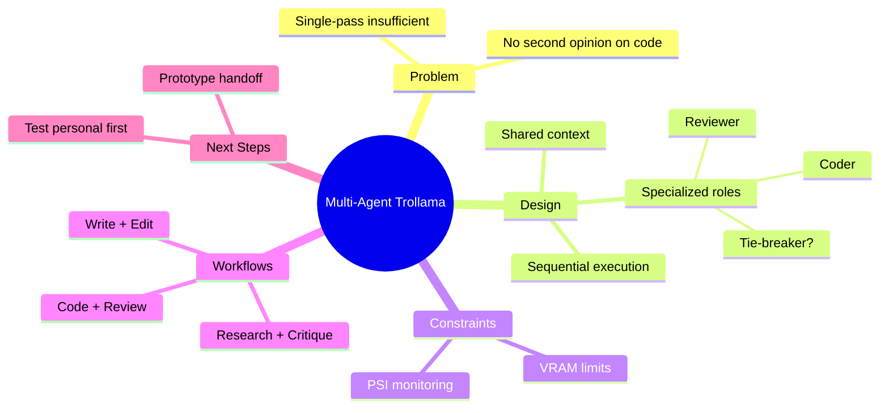

# Troise-AI Technical Design Document

## Table of Contents

- [1. Overview](#1-overview)
- [2. Design Principles](#2-design-principles)
- [3. System Architecture](#3-system-architecture)
- [4. Core Services](#4-core-services)
- [5. Skill System](#5-skill-system)
- [6. General Helper (Default Mode)](#6-general-helper-default-mode)
- [7. Braindump Workflow](#7-braindump-workflow)
- [8. Agentic Coding Workflow](#8-agentic-coding-workflow)
- [9. Second Brain Implementation](#9-second-brain-implementation)
- [10. Obsidian Integration](#10-obsidian-integration)
- [11. Data Models](#11-data-models)
- [12. API Specification](#12-api-specification)
- [13. DGX Spark Utilization](#13-dgx-spark-utilization)
- [14. Implementation Roadmap](#14-implementation-roadmap)

---

## 1. Overview

### 1.1 Purpose

Troise-AI is a personal AI augmentation system designed to:
- Transform raw thoughts into structured, actionable knowledge
- Enable checkpoint-based agentic coding with local models
- Serve as a searchable second brain with Obsidian integration
- Route natural language requests to 60+ specialized skills

### 1.2 Goals

| Goal | Description | Success Metric |
|------|-------------|----------------|
| **Capture** | Never lose an idea | All voice/text inputs processed and stored |
| **Refine** | AI questions back to sharpen thinking | Braindumps have 3+ question-answer cycles |
| **Remember** | Everything searchable and connected | brain_search returns relevant results in <2s |
| **Build** | Structured coding, not vibe coding | All code has spec → plan → checkpoint flow |
| **Route** | Natural language to right skill | 95%+ correct skill routing |

### 1.3 Non-Goals (v1)

- Multi-user support (this is personal)
- Cloud model fallback (DGX Spark only)
- Real-time collaboration
- Mobile native app (web interface on mobile)

---

## 2. Design Principles

### 2.1 Principle Hierarchy

Based on Daniel Miessler's Kai system, ordered by importance for Troise-AI:

```
┌─────────────────────────────────────────────────────────┐
│  1. SCAFFOLDING > MODEL                                 │
│     The structure matters more than the latest model    │
├─────────────────────────────────────────────────────────┤
│  2. CODE BEFORE PROMPTS (Determinism)                   │
│     80% deterministic code, 20% LLM prompts             │
├─────────────────────────────────────────────────────────┤
│  3. INTERACTIVE REFINEMENT                              │
│     AI questions back, challenges assumptions           │
├─────────────────────────────────────────────────────────┤
│  4. UNIX PHILOSOPHY                                     │
│     Skills call skills, composable pipelines            │
├─────────────────────────────────────────────────────────┤
│  5. CLI-FIRST TOOLS                                     │
│     AI invokes well-documented CLI commands             │
├─────────────────────────────────────────────────────────┤
│  6. SPECS, TESTS, EVALS                                 │
│     No vibe coding, everything testable                 │
├─────────────────────────────────────────────────────────┤
│  7. STRUCTURED HISTORY                                  │
│     Learnings, decisions, sessions - all queryable      │
├─────────────────────────────────────────────────────────┤
│  8. SELF-UPDATING                                       │
│     System monitors sources and improves itself         │
└─────────────────────────────────────────────────────────┘
```

### 2.2 Code Before Prompts

For every capability, evaluate in this order:

```python
def implement_capability(task):
    # 1. Can this be done with deterministic code?
    if can_solve_deterministically(task):
        return write_code(task)
    
    # 2. Can this be a CLI tool that AI invokes?
    if can_be_cli_tool(task):
        return create_cli_tool(task)
    
    # 3. Can this be a structured prompt with schema output?
    if can_have_structured_output(task):
        return create_structured_prompt(task)
    
    # 4. Last resort: free-form LLM generation
    return create_freeform_prompt(task)
```

**Target ratio:** 80% deterministic / 20% LLM

### 2.3 Interactive Refinement (Unique to Troise-AI)

Unlike simple capture-and-save systems, Troise-AI engages in dialogue:

```
┌─────────────────────────────────────────────────────────┐
│                  REFINEMENT LOOP                        │
├─────────────────────────────────────────────────────────┤
│                                                         │
│   User Input ──► AI Questions ──► User Responds ──┐    │
│        ▲                                          │    │
│        └──────────────────────────────────────────┘    │
│                    (repeat until refined)               │
│                                                         │
│   Question Types:                                       │
│   • CLARIFYING: "What specific problem?"               │
│   • CHALLENGING: "What assumptions here?"              │
│   • EXPANDING: "What alternatives?"                    │
│   • CONNECTING: "Related to [past note]?"              │
│   • ACTIONABLE: "What's the first step?"              │
│                                                         │
└─────────────────────────────────────────────────────────┘
```

---

## 3. System Architecture

### 3.1 High-Level Architecture

```
┌─────────────────────────────────────────────────────────────────────────────┐
│                              INTERFACES                                      │
├───────────────────┬───────────────────┬───────────────────┬─────────────────┤
│    Web App        │    Troise-Vibe      │    Discord        │   Obsidian      │
│    (FastAPI)      │    CLI            │    (Trollama)     │   (Storage)     │
│                   │                   │                   │                 │
│ Endpoints:        │ Commands:         │ Existing:         │ Via API:        │
│ • POST /capture   │ • troise-vibe       │ • Message handler │ • Read notes    │
│ • POST /voice     │ • troise capture    │ • Slash commands  │ • Write notes   │
│ • WS /chat        │ • troise brain      │ • Thread mgmt     │ • Search index  │
│ • GET /brain/*    │ • troise create     │                   │                 │
└─────────┬─────────┴─────────┬─────────┴─────────┬─────────┴────────┬────────┘
          │                   │                   │                  │
          └───────────────────┴─────────┬─────────┴──────────────────┘
                                        │
                                        ▼
┌─────────────────────────────────────────────────────────────────────────────┐
│                         FASTAPI ORCHESTRATION LAYER                          │
│                                                                              │
│  ┌──────────────────┐  ┌──────────────────┐  ┌──────────────────────────┐   │
│  │  Skill Router    │  │  Brain Service   │  │  Obsidian Service        │   │
│  │                  │  │                  │  │                          │   │
│  │  • 60+ skills    │  │  • brain_search  │  │  • Read/write notes      │   │
│  │  • Intent detect │  │  • brain_fetch   │  │  • Manage index          │   │
│  │  • Route table   │  │  • Index mgmt    │  │  • Template rendering    │   │
│  └──────────────────┘  └──────────────────┘  └──────────────────────────┘   │
│                                                                              │
│  ┌──────────────────┐  ┌──────────────────┐  ┌──────────────────────────┐   │
│  │  Transcription   │  │  File Generator  │  │  Question Engine         │   │
│  │  Service         │  │  Service         │  │                          │   │
│  │                  │  │                  │  │  • Question bank         │   │
│  │  • Whisper       │  │  • docx, xlsx    │  │  • Context-aware         │   │
│  │  • Local on DGX  │  │  • pdf, csv      │  │  • Refinement loop       │   │
│  └──────────────────┘  └──────────────────┘  └──────────────────────────┘   │
│                                                                              │
│  ┌───────────────────────────────────────────────────────────────────────┐  │
│  │                    EXISTING INFRASTRUCTURE                             │  │
│  │                                                                        │  │
│  │  • VRAM Orchestrator (PSI-based proactive eviction)                   │  │
│  │  • Circuit Breaker (crash loop prevention)                            │  │
│  │  • Model Registry (LRU tracking)                                      │  │
│  │  • DynamoDB Storage (conversations, sessions)                         │  │
│  │  • WebSocket Manager (streaming responses)                            │  │
│  │  • 6-Route Classifier (MATH, CODE, REASONING, etc.)                   │  │
│  └───────────────────────────────────────────────────────────────────────┘  │
└─────────────────────────────────────────────────────────────────────────────┘
                                        │
                                        ▼
┌─────────────────────────────────────────────────────────────────────────────┐
│                         DGX SPARK (128GB Unified Memory)                     │
│                                                                              │
│  Model Allocation (Aggressive Profile):                                      │
│                                                                              │
│  ┌─────────────┐ ┌─────────────┐ ┌─────────────┐ ┌─────────────┐           │
│  │ gpt-oss:20b │ │devstral:123b│ │magistral:24b│ │deepseek-r1  │           │
│  │ 13GB        │ │ 74GB        │ │ 15GB        │ │ :70b 42GB   │           │
│  │ CRITICAL    │ │ LOW         │ │ NORMAL      │ │ LOW         │           │
│  │             │ │             │ │             │ │             │           │
│  │ Router,     │ │ Complex     │ │ Reasoning,  │ │ Deep        │           │
│  │ General     │ │ Code        │ │ Research    │ │ Analysis    │           │
│  └─────────────┘ └─────────────┘ └─────────────┘ └─────────────┘           │
│                                                                              │
│  ┌─────────────┐ ┌─────────────┐ ┌─────────────┐ ┌─────────────┐           │
│  │ rnj-1:8b    │ │whisper-large│ │ flux:schnell│ │ qwen3-vl:8b │           │
│  │ 5GB         │ │ -v3 3GB     │ │ 12GB        │ │ 5GB         │           │
│  │ HIGH        │ │ HIGH        │ │ LOW         │ │ LOW         │           │
│  │             │ │             │ │             │ │             │           │
│  │ Fast tasks, │ │ Voice       │ │ Image       │ │ Vision,     │           │
│  │ Math        │ │ transcribe  │ │ generation  │ │ OCR         │           │
│  └─────────────┘ └─────────────┘ └─────────────┘ └─────────────┘           │
│                                                                              │
│  VRAM Budget: 110GB hard limit, PSI monitoring, proactive eviction          │
└─────────────────────────────────────────────────────────────────────────────┘
                                        │
                                        ▼
┌─────────────────────────────────────────────────────────────────────────────┐
│                              STORAGE LAYER                                   │
│                                                                              │
│  ┌────────────────────────┐  ┌────────────────────────┐                     │
│  │     Obsidian Vault     │  │     DynamoDB Local     │                     │
│  │                        │  │                        │                     │
│  │  /00-inbox/            │  │  Tables:               │                     │
│  │  /10-ideas/            │  │  • conversations       │                     │
│  │  /20-projects/         │  │  • users               │                     │
│  │  /30-knowledge/        │  │  • sessions            │                     │
│  │  /40-decisions/        │  │  • learnings (NEW)     │                     │
│  │  /_index/              │  │  • skill_usage (NEW)   │                     │
│  │                        │  │                        │                     │
│  │  Synced via:           │  │  Local Docker          │                     │
│  │  Obsidian Sync         │  │  container             │                     │
│  └────────────────────────┘  └────────────────────────┘                     │
└─────────────────────────────────────────────────────────────────────────────┘
```

### 3.2 Request Flow

```
User: "I've been thinking about adding multi-agent to Trollama"
                    │
                    ▼
┌───────────────────────────────────────────────────────────────┐
│ 1. INTERFACE LAYER                                            │
│    Web app receives text/voice input                          │
│    If voice: send to transcription service                    │
└───────────────────────────────────────────────────────────────┘
                    │
                    ▼
┌───────────────────────────────────────────────────────────────┐
│ 2. SKILL ROUTER                                               │
│    Detect intent: "braindump/ideation"                        │
│    Route to: skills/capture/braindump                         │
└───────────────────────────────────────────────────────────────┘
                    │
                    ▼
┌───────────────────────────────────────────────────────────────┐
│ 3. BRAINDUMP SKILL                                            │
│    a. Parse input, extract core idea                          │
│    b. Call brain_search() for related notes                   │
│    c. Generate clarifying questions                           │
│    d. Return questions to user                                │
└───────────────────────────────────────────────────────────────┘
                    │
                    ▼
┌───────────────────────────────────────────────────────────────┐
│ 4. REFINEMENT LOOP (repeat 2-5 times)                         │
│    User answers → AI generates follow-up questions            │
│    Incorporates: related notes, past decisions                │
└───────────────────────────────────────────────────────────────┘
                    │
                    ▼
┌───────────────────────────────────────────────────────────────┐
│ 5. SYNTHESIS                                                  │
│    • Structured summary                                       │
│    • Key insights                                             │
│    • Open questions                                           │
│    • Action items                                             │
│    • Brain map (mermaid diagram)                              │
└───────────────────────────────────────────────────────────────┘
                    │
                    ▼
┌───────────────────────────────────────────────────────────────┐
│ 6. SAVE & ROUTE                                               │
│    Save to Obsidian: /00-inbox/{date}-{slug}.md               │
│    Update index: /_index/ideas.md                             │
│    Offer next actions: research? spec? red-team? save-only?   │
└───────────────────────────────────────────────────────────────┘
```

---

## 4. Core Services

### 4.1 Skill Router Service

Routes natural language requests to appropriate skills.

```python
# services/skill_router.py

from enum import Enum
from typing import Optional, Dict, Any
from pydantic import BaseModel

class SkillCategory(Enum):
    CAPTURE = "capture"
    THINK = "think"
    BUILD = "build"
    RECALL = "recall"
    CREATE = "create"
    DOCUMENTS = "documents"
    RESEARCH = "research"
    COMMUNICATE = "communicate"
    ANALYZE = "analyze"
    PROJECT = "project"
    PERSONAL = "personal"
    META = "meta"

class RoutedSkill(BaseModel):
    category: SkillCategory
    skill_name: str
    confidence: float
    extracted_params: Dict[str, Any]

class SkillRouter:
    """
    Routes natural language requests to skills.
    
    Two-phase routing:
    1. Pattern matching (fast, deterministic)
    2. LLM classification (when patterns don't match)
    """
    
    PATTERNS = {
        # Capture patterns
        r"(thinking about|idea|thought|braindump|brain dump)": ("capture", "braindump"),
        r"(voice memo|transcribe|recording)": ("capture", "voice-memo"),
        r"(save this|clip this|capture)": ("capture", "quick-text"),
        
        # Think patterns
        r"(brainstorm|expand on|explore)": ("think", "brainstorm"),
        r"(analyze|break down|examine)": ("think", "analyze"),
        r"(red.?team|attack|critique|challenge)": ("think", "red-team"),
        r"(decide|decision|should I)": ("think", "decide"),
        
        # Build patterns
        r"(write.*(spec|specification))": ("build", "spec"),
        r"(create.*plan|plan.*(for|to))": ("build", "plan"),
        r"(write|create|implement|build).*(code|function|class)": ("build", "code"),
        r"(test|write.*tests)": ("build", "test"),
        r"(review|code review)": ("build", "review"),
        
        # Recall patterns
        r"(what did I|remember|recall|search.*brain)": ("recall", "brain-search"),
        r"(what.*decide|decision.*about)": ("recall", "what-decided"),
        r"(what.*learn|learned.*about)": ("recall", "what-learned"),
        
        # Create patterns
        r"(generate|create).*(image|picture|art)": ("create", "image"),
        r"(diagram|flowchart|mind.?map|brain.?map)": ("create", "diagram-brainmap"),
        r"(presentation|slides)": ("create", "presentation"),
        
        # Documents patterns
        r"(create|write|generate).*(doc|docx|word)": ("documents", "docx"),
        r"(create|write|generate).*(spreadsheet|xlsx|excel)": ("documents", "xlsx"),
        r"(create|write|generate).*(pdf)": ("documents", "pdf"),
        r"(create|write|generate).*(csv)": ("documents", "csv"),
        
        # Research patterns
        r"(search|look up|find).*(web|online|internet)": ("research", "web-search"),
        r"(research|deep dive|investigate)": ("research", "deep-research"),
        r"(compare|versus|vs|difference)": ("research", "compare"),
    }
    
    async def route(self, user_input: str, context: Dict = None) -> RoutedSkill:
        """Route user input to appropriate skill."""
        
        # Phase 1: Pattern matching (deterministic, fast)
        for pattern, (category, skill) in self.PATTERNS.items():
            if re.search(pattern, user_input.lower()):
                return RoutedSkill(
                    category=SkillCategory(category),
                    skill_name=skill,
                    confidence=0.9,
                    extracted_params=self._extract_params(user_input, skill)
                )
        
        # Phase 2: LLM classification (when patterns don't match)
        return await self._llm_classify(user_input, context)
    
    async def _llm_classify(self, user_input: str, context: Dict) -> RoutedSkill:
        """Use LLM for ambiguous routing."""
        # Uses gpt-oss:20b with structured output
        # Returns skill category, name, and confidence
        pass
    
    def _extract_params(self, user_input: str, skill: str) -> Dict[str, Any]:
        """Extract skill-specific parameters from input."""
        pass
```

### 4.2 Brain Service

Implements the brain_search / brain_fetch pattern.

```python
# services/brain_service.py

from typing import List, Dict, Optional
from pydantic import BaseModel
from datetime import datetime

class BrainSearchResult(BaseModel):
    note_path: str
    title: str
    date: datetime
    snippet: str  # Short summary
    relevance_score: float
    note_type: str  # idea, decision, learning, research

class BrainService:
    """
    Implements the second brain search/fetch pattern.
    
    Like web_search/web_fetch but for personal knowledge:
    - brain_search: Returns short index entries (fast)
    - brain_fetch: Returns full note content (detailed)
    """
    
    def __init__(self, obsidian_service: 'ObsidianService'):
        self.obsidian = obsidian_service
        self._index_cache = {}
        self._last_index_update = None
    
    async def search(
        self, 
        query: str, 
        limit: int = 10,
        note_types: List[str] = None,
        date_range: tuple = None
    ) -> List[BrainSearchResult]:
        """
        Search the brain index for relevant notes.
        
        Returns short summaries - like search engine results.
        Use brain_fetch() to get full content.
        """
        # 1. Load index (cached)
        index = await self._load_index()
        
        # 2. Semantic search using embeddings (qwen3-embedding:4b)
        query_embedding = await self._embed(query)
        
        # 3. Filter and rank
        results = []
        for note in index:
            if note_types and note['type'] not in note_types:
                continue
            if date_range and not self._in_range(note['date'], date_range):
                continue
            
            score = self._cosine_similarity(query_embedding, note['embedding'])
            if score > 0.5:  # Relevance threshold
                results.append(BrainSearchResult(
                    note_path=note['path'],
                    title=note['title'],
                    date=note['date'],
                    snippet=note['summary'],
                    relevance_score=score,
                    note_type=note['type']
                ))
        
        # 4. Sort by relevance
        results.sort(key=lambda x: x.relevance_score, reverse=True)
        return results[:limit]
    
    async def fetch(self, note_path: str) -> Dict:
        """
        Fetch full note content.
        
        Returns complete note with metadata, content, and links.
        """
        return await self.obsidian.read_note(note_path)
    
    async def what_decided(self, topic: str) -> List[BrainSearchResult]:
        """Shortcut: Search for decisions about a topic."""
        return await self.search(
            query=topic,
            note_types=['decision'],
            limit=5
        )
    
    async def what_learned(self, topic: str) -> List[BrainSearchResult]:
        """Shortcut: Search for learnings about a topic."""
        return await self.search(
            query=topic,
            note_types=['learning'],
            limit=5
        )
    
    async def related_to(self, note_path: str) -> List[BrainSearchResult]:
        """Find notes related to a given note via backlinks."""
        pass
    
    async def rebuild_index(self):
        """Rebuild the entire brain index (expensive)."""
        pass
```

### 4.3 Question Engine

Generates context-aware questions for braindump refinement.

```python
# services/question_engine.py

from enum import Enum
from typing import List, Dict
import random

class QuestionType(Enum):
    CLARIFYING = "clarifying"
    CHALLENGING = "challenging"
    EXPANDING = "expanding"
    CONNECTING = "connecting"
    ACTIONABLE = "actionable"

class QuestionBank:
    """Static question templates."""
    
    TEMPLATES = {
        QuestionType.CLARIFYING: [
            "What specific problem are you trying to solve?",
            "Can you give me a concrete example?",
            "What does success look like here?",
            "Who is this ultimately for?",
            "What triggered this thought?",
            "What's the context I should know?",
        ],
        QuestionType.CHALLENGING: [
            "What assumptions are you making?",
            "What would have to be true for this to work?",
            "What's the strongest argument against this?",
            "Why hasn't this been done before?",
            "What could go wrong?",
            "What are you potentially missing?",
        ],
        QuestionType.EXPANDING: [
            "What are three alternative approaches?",
            "How would an expert in this field think about it?",
            "What if you had 10x the resources? 1/10th?",
            "What's the adjacent problem worth solving?",
            "How does this connect to your broader goals?",
            "What would the opposite approach look like?",
        ],
        QuestionType.CONNECTING: [
            "How does this relate to {related_note}?",
            "You explored {topic} before - is this the same direction?",
            "This reminds me of your decision on {decision} - relevant?",
            "You learned {learning} - does that apply here?",
        ],
        QuestionType.ACTIONABLE: [
            "What's the smallest first step?",
            "What would you need to know to move forward?",
            "What's blocking you right now?",
            "If you had to ship something in 24 hours, what would it be?",
            "Who could help with this?",
            "What's the deadline, if any?",
        ],
    }

class QuestionEngine:
    """
    Generates context-aware questions for braindump refinement.
    
    Selects question types based on:
    - Stage of refinement (early = clarifying, later = actionable)
    - Content of user's responses
    - Related notes from brain_search
    """
    
    def __init__(self, brain_service: 'BrainService', llm_service: 'LLMService'):
        self.brain = brain_service
        self.llm = llm_service
        self.bank = QuestionBank()
    
    async def generate_questions(
        self,
        raw_input: str,
        conversation_history: List[Dict],
        related_notes: List['BrainSearchResult'],
        num_questions: int = 2
    ) -> List[str]:
        """
        Generate context-aware questions.
        
        Uses hybrid approach:
        1. Template selection based on stage
        2. LLM customization based on content
        3. Connection questions from related notes
        """
        questions = []
        stage = len(conversation_history)
        
        # Determine question type distribution based on stage
        if stage == 0:
            types = [QuestionType.CLARIFYING, QuestionType.CLARIFYING]
        elif stage == 1:
            types = [QuestionType.CLARIFYING, QuestionType.CHALLENGING]
        elif stage == 2:
            types = [QuestionType.CHALLENGING, QuestionType.EXPANDING]
        elif stage == 3:
            types = [QuestionType.EXPANDING, QuestionType.CONNECTING]
        else:
            types = [QuestionType.CONNECTING, QuestionType.ACTIONABLE]
        
        # Generate questions for each type
        for q_type in types[:num_questions]:
            if q_type == QuestionType.CONNECTING and related_notes:
                # Use related notes for connecting questions
                note = random.choice(related_notes)
                template = random.choice(self.bank.TEMPLATES[q_type])
                question = await self._customize_with_context(
                    template, 
                    raw_input, 
                    related_note=note
                )
            else:
                template = random.choice(self.bank.TEMPLATES[q_type])
                question = await self._customize_with_llm(
                    template, 
                    raw_input, 
                    conversation_history
                )
            questions.append(question)
        
        return questions
    
    async def _customize_with_llm(
        self, 
        template: str, 
        context: str, 
        history: List[Dict]
    ) -> str:
        """Use LLM to make template question more specific."""
        # Uses rnj-1:8b for fast customization
        pass
    
    async def _customize_with_context(
        self, 
        template: str, 
        context: str, 
        related_note: 'BrainSearchResult'
    ) -> str:
        """Fill in template with related note context."""
        return template.format(
            related_note=related_note.title,
            topic=related_note.title,
            decision=related_note.title,
            learning=related_note.snippet
        )
```

### 4.4 Obsidian Service

Manages reading, writing, and indexing Obsidian vault.

```python
# services/obsidian_service.py

from pathlib import Path
from typing import Dict, List, Optional
from datetime import datetime
import yaml
import re

class ObsidianService:
    """
    Manages Obsidian vault operations.
    
    Features:
    - Read/write notes with frontmatter
    - Manage index files
    - Parse wikilinks
    - Template rendering
    """
    
    def __init__(self, vault_path: str):
        self.vault = Path(vault_path)
        self.templates_dir = self.vault / "_templates"
        self.index_dir = self.vault / "_index"
    
    async def save_note(
        self,
        path: str,
        content: str,
        frontmatter: Dict = None,
        template: str = None
    ) -> str:
        """
        Save a note to the vault.
        
        Args:
            path: Relative path within vault (e.g., "00-inbox/my-note.md")
            content: Note content (markdown)
            frontmatter: YAML frontmatter dict
            template: Template name to use (optional)
        
        Returns:
            Full path to saved note
        """
        full_path = self.vault / path
        full_path.parent.mkdir(parents=True, exist_ok=True)
        
        # Apply template if specified
        if template:
            content = await self._apply_template(template, content, frontmatter)
        
        # Build note content
        note_content = ""
        if frontmatter:
            note_content += "---\n"
            note_content += yaml.dump(frontmatter, default_flow_style=False)
            note_content += "---\n\n"
        note_content += content
        
        full_path.write_text(note_content)
        
        # Update index
        await self._update_index(path, frontmatter)
        
        return str(full_path)
    
    async def read_note(self, path: str) -> Dict:
        """
        Read a note with parsed frontmatter and content.
        
        Returns:
            {
                "path": str,
                "frontmatter": dict,
                "content": str,
                "links": List[str],  # Outgoing wikilinks
                "backlinks": List[str]  # Incoming wikilinks
            }
        """
        full_path = self.vault / path
        raw = full_path.read_text()
        
        frontmatter, content = self._parse_frontmatter(raw)
        links = self._extract_wikilinks(content)
        backlinks = await self._find_backlinks(path)
        
        return {
            "path": path,
            "frontmatter": frontmatter,
            "content": content,
            "links": links,
            "backlinks": backlinks
        }
    
    async def search_vault(self, query: str, folder: str = None) -> List[str]:
        """Simple text search across vault."""
        results = []
        search_path = self.vault / folder if folder else self.vault
        
        for md_file in search_path.rglob("*.md"):
            if query.lower() in md_file.read_text().lower():
                results.append(str(md_file.relative_to(self.vault)))
        
        return results
    
    async def update_index(self, category: str, entry: Dict):
        """Add entry to a category index."""
        index_path = self.index_dir / f"{category}.md"
        
        # Append to index
        with open(index_path, "a") as f:
            f.write(f"\n- [[{entry['path']}]] - {entry['summary']} ({entry['date']})")
    
    async def rebuild_all_indexes(self):
        """Rebuild all index files by scanning vault."""
        pass
    
    def _parse_frontmatter(self, content: str) -> tuple:
        """Parse YAML frontmatter from note content."""
        if content.startswith("---"):
            parts = content.split("---", 2)
            if len(parts) >= 3:
                frontmatter = yaml.safe_load(parts[1])
                body = parts[2].strip()
                return frontmatter, body
        return {}, content
    
    def _extract_wikilinks(self, content: str) -> List[str]:
        """Extract [[wikilinks]] from content."""
        return re.findall(r'\[\[([^\]]+)\]\]', content)
    
    async def _find_backlinks(self, note_path: str) -> List[str]:
        """Find all notes that link to this note."""
        note_name = Path(note_path).stem
        backlinks = []
        
        for md_file in self.vault.rglob("*.md"):
            if f"[[{note_name}]]" in md_file.read_text():
                backlinks.append(str(md_file.relative_to(self.vault)))
        
        return backlinks
    
    async def _apply_template(self, template: str, content: str, data: Dict) -> str:
        """Apply a template to content."""
        template_path = self.templates_dir / f"{template}.md"
        template_content = template_path.read_text()
        
        # Simple variable substitution
        for key, value in (data or {}).items():
            template_content = template_content.replace(f"{{{{{key}}}}}", str(value))
        
        template_content = template_content.replace("{{content}}", content)
        return template_content
```

### 4.5 Transcription Service

Voice-to-text using Whisper on DGX Spark.

```python
# services/transcription_service.py

from pathlib import Path
import subprocess
import tempfile

class TranscriptionService:
    """
    Voice transcription using Whisper large-v3 on DGX Spark.
    
    Runs locally - no external API calls.
    """
    
    def __init__(self, model: str = "whisper-large-v3", ollama_host: str = "localhost:11434"):
        self.model = model
        self.ollama_host = ollama_host
    
    async def transcribe(self, audio_path: str) -> str:
        """
        Transcribe audio file to text.
        
        Supports: mp3, wav, m4a, webm, ogg
        """
        # Use Whisper via Ollama or direct whisper.cpp
        # DGX Spark has plenty of memory for large-v3
        
        result = subprocess.run([
            "whisper",
            audio_path,
            "--model", "large-v3",
            "--output_format", "txt",
            "--language", "en"
        ], capture_output=True, text=True)
        
        return result.stdout
    
    async def transcribe_stream(self, audio_stream) -> str:
        """Transcribe from audio stream (real-time)."""
        pass
```

### 4.6 File Generator Service

Generates documents (docx, xlsx, pdf, csv).

```python
# services/file_generator_service.py

from pathlib import Path
from typing import Dict, Any
from enum import Enum

class FileType(Enum):
    DOCX = "docx"
    XLSX = "xlsx"
    PDF = "pdf"
    CSV = "csv"
    HTML = "html"
    MARKDOWN = "markdown"

class FileGeneratorService:
    """
    Generates various file formats.
    
    Uses existing skills from /mnt/skills/public/
    """
    
    SKILL_PATHS = {
        FileType.DOCX: "/mnt/skills/public/docx/SKILL.md",
        FileType.XLSX: "/mnt/skills/public/xlsx/SKILL.md",
        FileType.PDF: "/mnt/skills/public/pdf/SKILL.md",
    }
    
    async def generate(
        self,
        file_type: FileType,
        content: str,
        metadata: Dict[str, Any] = None,
        template: str = None
    ) -> str:
        """
        Generate a file of specified type.
        
        Returns path to generated file.
        """
        # Read skill instructions
        skill_path = self.SKILL_PATHS.get(file_type)
        if skill_path:
            skill_instructions = Path(skill_path).read_text()
        
        # Generate based on type
        if file_type == FileType.DOCX:
            return await self._generate_docx(content, metadata, template)
        elif file_type == FileType.XLSX:
            return await self._generate_xlsx(content, metadata)
        elif file_type == FileType.PDF:
            return await self._generate_pdf(content, metadata)
        elif file_type == FileType.CSV:
            return await self._generate_csv(content)
        
    async def _generate_docx(self, content: str, metadata: Dict, template: str) -> str:
        """Generate Word document using python-docx."""
        from docx import Document
        
        doc = Document()
        # ... implementation
        
        output_path = f"/tmp/output_{datetime.now().timestamp()}.docx"
        doc.save(output_path)
        return output_path
```

---

## 5. Skill System

### 5.1 Skill Structure

Each skill follows this structure:

```
skills/
└── {category}/
    └── {skill-name}/
        ├── SKILL.md           # Routing instructions + metadata
        ├── workflows/         # Prompt templates
        │   ├── main.md        # Primary workflow
        │   └── variants/      # Alternative approaches
        ├── tools/             # Deterministic CLI tools
        │   ├── cli.py         # Click-based CLI
        │   └── utils.py       # Helper functions
        └── tests/             # Skill tests
            └── test_skill.py
```

### 5.2 SKILL.md Format

```markdown
---
name: braindump
category: capture
version: 1.0.0
use_when: |
  User shares raw idea, thought, reflection, or says:
  - "I've been thinking about..."
  - "brain dump"
  - "new idea"
  - "thought dump"
  
models:
  primary: magistral:24b
  fast: rnj-1:8b
  transcribe: whisper-large-v3
  
calls:
  - recall/brain-search
  - think/brainstorm
  - create/diagram-brainmap
  
outputs:
  - obsidian_note
  - brain_index_entry
---

## Purpose

Transform raw thoughts into structured, questioned, actionable notes.

## Workflow

1. **Capture**: Transcribe (if voice), extract core ideas
2. **Question Loop**: Ask 2-3 questions, wait for response, repeat 3-5 times
3. **Synthesize**: Summary, insights, questions, action items
4. **Visualize**: Generate brain map diagram
5. **Connect**: brain_search for related notes
6. **Save**: Write to Obsidian, update index
7. **Route**: Offer next actions

## Parameters

| Param | Type | Default | Description |
|-------|------|---------|-------------|
| max_questions | int | 5 | Maximum question rounds |
| auto_save | bool | true | Save automatically after synthesis |
| generate_diagram | bool | true | Generate brain map |

## Example

User: "I've been thinking about multi-agent workflows for Trollama"

AI: "Interesting! Let me understand this better..."
[Questions, refinement loop, synthesis, save]
```

### 5.3 Complete Skill Taxonomy (60+)

```
skills/
│
├── 💬 general/                        # Default helper mode
│   ├── chat/                          # Open conversation
│   ├── answer/                        # Direct Q&A
│   ├── discuss/                       # Back-and-forth discussion
│   ├── help/                          # General assistance
│   └── route/                         # Smart routing to other skills
│
├── 📥 capture/                         # Getting stuff IN
│   ├── braindump/                      # Raw thoughts → refined notes
│   ├── voice-memo/                     # Audio → transcript → process
│   ├── quick-text/                     # Text → inbox
│   ├── web-clip/                       # URL → saved article
│   ├── screenshot-ocr/                 # Image → text
│   └── meeting-notes/                  # Audio → structured notes
│
├── 🧠 think/                           # Processing & refinement
│   ├── brainstorm/                     # Expand, divergent thinking
│   ├── analyze/                        # Break down, examine
│   ├── synthesize/                     # Connect ideas, patterns
│   ├── question/                       # Socratic questioning
│   ├── decide/                         # Decision framework
│   ├── red-team/                       # Attack ideas
│   ├── first-principles/              # Break to fundamentals
│   ├── brain-map/                      # Visual diagram
│   ├── pros-cons/                      # Weighted comparison
│   └── prioritize/                     # Rank by criteria
│
├── 🔨 build/                           # Code & creation
│   ├── spec/                           # Write specifications
│   ├── plan/                           # Break into tasks
│   ├── code/                           # Agentic coding
│   ├── test/                           # Generate/run tests
│   ├── review/                         # Code review
│   ├── refactor/                       # Improve code
│   ├── debug/                          # Find/fix issues
│   ├── document/                       # Code docs
│   └── scaffold/                       # Project setup
│
├── 🔍 recall/                          # 2nd brain queries
│   ├── brain-search/                   # Index search
│   ├── brain-fetch/                    # Full note
│   ├── what-decided/                   # Decision lookup
│   ├── what-learned/                   # Learning lookup
│   ├── related-to/                     # Find connections
│   ├── timeline/                       # History of topic
│   └── summary/                        # Summarize notes
│
├── 🎨 create/                          # Output generation
│   ├── image/                          # Flux on DGX
│   ├── diagram-mermaid/               # Flowcharts
│   ├── diagram-brainmap/              # Mind maps
│   ├── diagram-architecture/          # System diagrams
│   ├── presentation/                   # Slides
│   ├── video-script/                   # Scripts
│   └── mockup/                         # UI mockups
│
├── 📄 documents/                       # File generation
│   ├── docx/                           # Word documents
│   ├── pdf/                            # PDF generation
│   ├── xlsx/                           # Spreadsheets
│   ├── csv/                            # Data exports
│   ├── markdown/                       # MD files
│   ├── html/                           # Web pages
│   └── json/                           # Structured data
│
├── 🔬 research/                        # External knowledge
│   ├── web-search/                     # Quick search
│   ├── deep-research/                  # Multi-source
│   ├── tech-lookup/                    # Docs, APIs
│   ├── compare/                        # X vs Y
│   ├── summarize-source/              # Summarize URL
│   ├── extract-data/                   # Pull structured data
│   └── monitor/                        # Track sources
│
├── 💬 communicate/                     # Output for humans
│   ├── explain/                        # ELI5 to expert
│   ├── email-draft/                    # Professional emails
│   ├── message-draft/                  # Casual messages
│   ├── tweet-thread/                   # Social content
│   ├── blog-post/                      # Long-form
│   ├── newsletter/                     # Newsletter format
│   └── proposal/                       # Business proposals
│
├── 📊 analyze/                         # Data analysis
│   ├── data-analyze/                   # CSV/JSON analysis
│   ├── sentiment/                      # Sentiment analysis
│   ├── extract-entities/              # Pull key info
│   ├── compare-docs/                   # Diff documents
│   ├── trends/                         # Find patterns
│   └── metrics/                        # Calculate KPIs
│
├── 🛠️ project/                        # Project management
│   ├── status/                         # Where am I?
│   ├── next-actions/                   # What's next?
│   ├── blockers/                       # What's blocking?
│   ├── update-spec/                    # Revise specs
│   ├── retrospective/                  # What worked?
│   └── roadmap/                        # Plan timeline
│
├── 🏠 personal/                        # Your specific workflows
│   ├── matcha-recommend/              # Troscha matching
│   ├── trollama-support/              # Community Q&A
│   ├── weekly-review/                  # Weekly reflection
│   └── daily-standup/                  # Daily check-in
│
└── ⚙️ meta/                           # System management
    ├── upgrade/                        # Self-improvement
    ├── index-rebuild/                  # Rebuild brain
    ├── reflect/                        # Session → learnings
    ├── skill-create/                   # Make new skills
    ├── skill-test/                     # Test skills
    └── health-check/                   # Diagnostics
```

---

## 6. General Helper (Default Mode)

### 6.1 Philosophy

The General Helper is the **primary interface** - you just talk naturally, and it intelligently routes to any of the 60+ skills when needed. Most of the time, you won't even notice skills being invoked.

**Core principle:** Talk like you're chatting with a smart assistant. The system figures out what to do.

```
You: "What's the weather like in Tokyo?"
AI: [Answers directly - no skill needed]

You: "Generate an image of a sunset over mountains"
AI: [Silently invokes create/image skill, returns result]

You: "I've been thinking about multi-agent workflows..."
AI: [Detects braindump intent, starts questioning loop]

You: "Compare PostgreSQL vs DynamoDB for my use case"
AI: [Invokes research/compare, synthesizes findings]

You: "Help me write code for user authentication"
AI: [Routes to build/code with checkpoint workflow]
```

### 6.2 Intelligent Routing Architecture

```
┌─────────────────────────────────────────────────────────────────────────────┐
│                         GENERAL HELPER FLOW                                  │
└─────────────────────────────────────────────────────────────────────────────┘

User Input (natural language)
    │
    ▼
┌─────────────────────────────────────────────────────────────────────────────┐
│  STEP 1: CONTEXT ENRICHMENT                                                 │
│                                                                             │
│  • brain_search() for relevant notes (parallel, non-blocking)              │
│  • Load session history                                                     │
│  • Check user preferences                                                   │
└─────────────────────────────────────────────────────────────────────────────┘
    │
    ▼
┌─────────────────────────────────────────────────────────────────────────────┐
│  STEP 2: INTENT CLASSIFICATION (rnj-1:8b - fast)                           │
│                                                                             │
│  Determine:                                                                 │
│  • Can I answer this directly? → DIRECT                                    │
│  • Does this need a skill? → Which one(s)?                                 │
│  • Is this a multi-step workflow? → BRAINDUMP / CODE                       │
│  • Is this a discussion? → CONVERSATIONAL                                  │
└─────────────────────────────────────────────────────────────────────────────┘
    │
    ├─────────────────────────────────────────────────────────────────────┐
    │                                                                     │
    ▼                                                                     ▼
┌─────────────────────┐                              ┌─────────────────────────┐
│  DIRECT RESPONSE    │                              │  SKILL INVOCATION       │
│                     │                              │                         │
│  Simple Q&A, chat,  │                              │  Route to appropriate   │
│  explanations       │                              │  skill from 60+ catalog │
│                     │                              │                         │
│  Model: gpt-oss:20b │                              │  Skills handle:         │
│  or rnj-1:8b        │                              │  • Execution            │
└─────────────────────┘                              │  • Tool calls           │
                                                     │  • Output formatting    │
                                                     └────────────┬────────────┘
                                                                  │
    ┌─────────────────────────────────────────────────────────────┘
    │
    ▼
┌─────────────────────────────────────────────────────────────────────────────┐
│  STEP 3: RESPONSE COMPOSITION                                               │
│                                                                             │
│  • Combine skill outputs                                                    │
│  • Add context from brain if relevant                                       │
│  • Format for user (hide skill mechanics unless asked)                      │
│  • Update session memory                                                    │
└─────────────────────────────────────────────────────────────────────────────┘
    │
    ▼
Response to User (feels like natural conversation)
```

### 6.3 Skill Routing Logic

The router can invoke **any skill** based on user intent:

```python
class GeneralHelper:
    """
    The main interface - routes to 60+ skills transparently.
    """
    
    def __init__(self, skill_registry: SkillRegistry, brain: BrainService):
        self.skills = skill_registry  # All 60+ skills
        self.brain = brain
        self.classifier = IntentClassifier(model="rnj-1:8b")
    
    async def handle(self, message: str, session: Session) -> Response:
        """
        Main entry point - handle any user message.
        """
        # 1. Enrich with context (parallel)
        brain_context, session_context = await asyncio.gather(
            self.brain.quick_search(message, limit=5),
            self._get_session_context(session)
        )
        
        # 2. Classify intent and determine routing
        intent = await self.classifier.classify(
            message=message,
            session_context=session_context,
            brain_context=brain_context
        )
        
        # 3. Route based on intent
        if intent.type == "DIRECT":
            # Answer directly, no skill needed
            return await self._direct_response(message, session, brain_context)
        
        elif intent.type == "SKILL":
            # Invoke one or more skills
            return await self._invoke_skills(
                message=message,
                skills=intent.skills,  # e.g., ["create/image"] or ["research/compare", "create/diagram"]
                session=session,
                brain_context=brain_context
            )
        
        elif intent.type == "WORKFLOW":
            # Start a multi-step workflow (braindump, code, etc.)
            return await self._start_workflow(
                workflow=intent.workflow,  # "braindump", "code", etc.
                message=message,
                session=session
            )
        
        elif intent.type == "CONVERSATIONAL":
            # Back-and-forth discussion with memory
            return await self._conversational_response(message, session, brain_context)
    
    async def _invoke_skills(
        self, 
        message: str, 
        skills: List[str], 
        session: Session,
        brain_context: List
    ) -> Response:
        """
        Invoke one or more skills and compose response.
        """
        results = []
        
        for skill_path in skills:
            skill = self.skills.get(skill_path)
            
            # Extract parameters for this skill
            params = await self._extract_skill_params(message, skill)
            
            # Execute skill
            result = await skill.execute(
                input=message,
                params=params,
                context={
                    "session": session,
                    "brain": brain_context
                }
            )
            
            results.append(result)
        
        # Compose final response
        return self._compose_response(results, session)
```

### 6.4 Intent Classification

The classifier determines what the user needs:

```python
class IntentClassifier:
    """
    Classifies user intent to determine routing.
    Uses fast model (rnj-1:8b) for low latency.
    """
    
    CLASSIFICATION_PROMPT = """
    Analyze this user message and determine the best way to handle it.
    
    Available skill categories:
    - capture/: braindump, voice-memo, quick-text, web-clip
    - think/: brainstorm, analyze, synthesize, decide, red-team, first-principles
    - build/: spec, plan, code, test, review, refactor, debug
    - recall/: brain-search, brain-fetch, what-decided, what-learned
    - create/: image, diagram-mermaid, diagram-brainmap, presentation
    - documents/: docx, pdf, xlsx, csv, markdown, html
    - research/: web-search, deep-research, compare, summarize-source
    - communicate/: explain, email-draft, message-draft, blog-post
    - analyze/: data-analyze, sentiment, extract-entities, trends
    - project/: status, next-actions, blockers, retrospective
    
    Respond with JSON:
    {
        "type": "DIRECT" | "SKILL" | "WORKFLOW" | "CONVERSATIONAL",
        "skills": ["skill/name", ...],  // if type is SKILL
        "workflow": "braindump" | "code",  // if type is WORKFLOW
        "confidence": 0.0-1.0,
        "reasoning": "brief explanation"
    }
    
    User message: {message}
    Session context: {context}
    """
    
    async def classify(self, message: str, session_context: dict, brain_context: list) -> Intent:
        # Use fast model for classification
        response = await self.llm.generate(
            model="rnj-1:8b",
            prompt=self.CLASSIFICATION_PROMPT.format(
                message=message,
                context=session_context
            ),
            temperature=0.1  # Deterministic
        )
        
        return Intent.parse(response)
```

### 6.5 Example Routings

| User Says | Intent Type | Skills Invoked | User Sees |
|-----------|-------------|----------------|-----------|
| "What's async vs threading?" | DIRECT | None | Direct explanation |
| "Generate a logo for my app" | SKILL | create/image | Generated image |
| "Create a spreadsheet of my expenses" | SKILL | documents/xlsx | Excel file |
| "Compare React vs Vue" | SKILL | research/compare | Comparison analysis |
| "I've been thinking about X..." | WORKFLOW | braindump | Question loop starts |
| "Help me build authentication" | WORKFLOW | code | Spec → Plan → Code |
| "What did I decide about routing?" | SKILL | recall/what-decided | Past decisions |
| "Red team this idea" | SKILL | think/red-team | Critical analysis |
| "Summarize this article: [URL]" | SKILL | research/summarize-source | Summary |
| "Let's discuss my career options" | CONVERSATIONAL | None | Discussion mode |
| "Create a diagram of this flow" | SKILL | create/diagram-mermaid | Mermaid diagram |
| "Write an email declining the offer" | SKILL | communicate/email-draft | Draft email |
| "Analyze this CSV" | SKILL | analyze/data-analyze | Data insights |
| "What's the status of Trollama?" | SKILL | project/status + recall/brain-search | Project status |

### 6.6 Multi-Skill Composition

The General Helper can invoke **multiple skills** in a single request - either sequentially (output of one feeds the next) or in parallel (independent tasks combined).

#### Composition Patterns

```
┌─────────────────────────────────────────────────────────────────────────────┐
│                      MULTI-SKILL COMPOSITION PATTERNS                        │
└─────────────────────────────────────────────────────────────────────────────┘

SEQUENTIAL (Pipeline)
─────────────────────
Skill A output → Skill B input → Skill C input → Final result

Example: "Research competitors and create a comparison spreadsheet"
         research/deep-research → analyze/compare → documents/xlsx


PARALLEL (Fan-out)
──────────────────
              ┌→ Skill A ─┐
User Input ───┼→ Skill B ─┼→ Combined Result
              └→ Skill C ─┘

Example: "Analyze this data and visualize the trends"
         analyze/data-analyze ─┬→ Combined response
         create/diagram-mermaid┘


CONDITIONAL (Branching)
───────────────────────
Skill A → [If condition] → Skill B
                        → Skill C

Example: "Check my notes for auth decisions, then help implement or create spec"
         recall/what-decided → [found?] → build/code
                                       → build/spec


ITERATIVE (Loop)
────────────────
Skill A → Skill B → [Check] → Skill B → [Check] → Done
                         ↑_______________|

Example: "Write code until tests pass"
         build/code → build/test → [pass?] → done
                          ↑____[fail]____|
```

#### Examples

**Sequential Pipeline:**
```python
# "Research DynamoDB vs PostgreSQL and create a comparison diagram"

intent = {
    "type": "SKILL",
    "skills": [
        {"skill": "research/compare", "output_as": "comparison_data"},
        {"skill": "create/diagram-mermaid", "input_from": "comparison_data"}
    ],
    "composition": "sequential"
}

# Execution:
# 1. research/compare runs → produces structured comparison
# 2. create/diagram-mermaid receives comparison → produces visual
# 3. User sees: analysis text + diagram
```

**Parallel Execution:**
```python
# "Generate a blog post about AI trends with an accompanying image"

intent = {
    "type": "SKILL", 
    "skills": [
        {"skill": "communicate/blog-post", "params": {"topic": "AI trends"}},
        {"skill": "create/image", "params": {"prompt": "futuristic AI concept"}}
    ],
    "composition": "parallel"
}

# Execution:
# 1. Both skills run simultaneously (different models, no dependency)
# 2. Results combined in response
# 3. User sees: blog post + generated image
```

**Complex Multi-Step:**
```python
# "What did I decide about auth? Summarize the research, then help me implement it"

intent = {
    "type": "SKILL",
    "skills": [
        {"skill": "recall/what-decided", "query": "authentication"},
        {"skill": "recall/brain-fetch", "input_from": "step1.note_path"},
        {"skill": "research/summarize-source", "input_from": "step2.content"},
    ],
    "follow_up": {
        "type": "WORKFLOW",
        "workflow": "code",
        "context_from": ["step1", "step2", "step3"]
    }
}

# Execution:
# 1. Find past decisions about auth
# 2. Fetch the full note
# 3. Summarize the key points
# 4. Ask user: "Ready to implement based on this?"
# 5. If yes → Start coding workflow with full context
```

**Research + Create + Save:**
```python
# "Research the latest on LLM fine-tuning, create a summary doc, and save to my notes"

intent = {
    "type": "SKILL",
    "skills": [
        {"skill": "research/deep-research", "output_as": "research"},
        {"skill": "documents/docx", "input_from": "research", "output_as": "doc"},
        {"skill": "capture/quick-text", "input_from": "research.summary"}
    ],
    "composition": "sequential"
}

# User gets:
# 1. Research findings displayed
# 2. Word doc download link
# 3. Summary saved to Obsidian inbox
```

#### Skill Composition Engine

```python
class SkillComposer:
    """
    Orchestrates multi-skill execution with data flow.
    """
    
    async def execute_composition(
        self, 
        skills: List[SkillSpec],
        composition: str,  # "sequential", "parallel", "conditional"
        session: Session
    ) -> ComposedResult:
        
        if composition == "sequential":
            return await self._execute_sequential(skills, session)
        elif composition == "parallel":
            return await self._execute_parallel(skills, session)
        elif composition == "conditional":
            return await self._execute_conditional(skills, session)
    
    async def _execute_sequential(
        self, 
        skills: List[SkillSpec], 
        session: Session
    ) -> ComposedResult:
        """Execute skills in sequence, passing outputs forward."""
        
        context = {"session": session}
        results = []
        
        for i, skill_spec in enumerate(skills):
            skill = self.registry.get(skill_spec.skill)
            
            # Resolve input from previous step if specified
            if skill_spec.input_from:
                skill_input = self._resolve_reference(
                    skill_spec.input_from, 
                    results
                )
            else:
                skill_input = skill_spec.params
            
            # Execute skill
            result = await skill.execute(
                input=skill_input,
                context=context
            )
            
            # Store result for potential use by later skills
            results.append({
                "step": i + 1,
                "skill": skill_spec.skill,
                "output": result,
                "output_as": skill_spec.output_as
            })
            
            # Update context for next skill
            context[f"step{i+1}"] = result
            if skill_spec.output_as:
                context[skill_spec.output_as] = result
        
        return ComposedResult(
            steps=results,
            final_output=results[-1]["output"],
            composition_type="sequential"
        )
    
    async def _execute_parallel(
        self, 
        skills: List[SkillSpec], 
        session: Session
    ) -> ComposedResult:
        """Execute skills in parallel, combine results."""
        
        tasks = [
            self.registry.get(s.skill).execute(
                input=s.params,
                context={"session": session}
            )
            for s in skills
        ]
        
        results = await asyncio.gather(*tasks)
        
        return ComposedResult(
            steps=[
                {"skill": s.skill, "output": r}
                for s, r in zip(skills, results)
            ],
            final_output=self._combine_outputs(results),
            composition_type="parallel"
        )
```

#### Natural Language → Multi-Skill Detection

The classifier detects when multiple skills are needed:

```python
MULTI_SKILL_PATTERNS = [
    # Sequential indicators
    (r"(.+) and then (.+)", "sequential"),
    (r"(.+), then (.+)", "sequential"),
    (r"first (.+), then (.+)", "sequential"),
    (r"(.+) and create (.+)", "sequential"),
    (r"(.+) and save (.+)", "sequential"),
    
    # Parallel indicators  
    (r"(.+) and also (.+)", "parallel"),
    (r"(.+) with (.+)", "parallel"),
    (r"(.+) along with (.+)", "parallel"),
    
    # Conditional indicators
    (r"if (.+) then (.+) else (.+)", "conditional"),
    (r"(.+), and if (.+) then (.+)", "conditional"),
]

# Examples detected:
# "Research X and create a diagram" → sequential: [research, create]
# "Generate image and write blog post" → parallel: [create/image, communicate/blog]
# "Check notes, then implement" → sequential: [recall, build/code]
```

### 6.7 Transparent vs Explicit Invocation

**Transparent (default):** User doesn't see skill mechanics
```
User: "Generate an image of a cyberpunk city"
AI: [Shows generated image]
    "Here's your cyberpunk cityscape. Want me to adjust anything?"
```

**Explicit (when helpful):** Show what's happening
```
User: "Research the latest on transformer architectures"
AI: "I'll do a deep research on this. This might take a moment..."
    [Invokes research/deep-research]
    [Shows sources being consulted]
    "Here's what I found from 5 sources..."
```

**User can always ask:** "What skills did you use?"
```
User: "What did you just do?"
AI: "I used the research/deep-research skill which searched 
     academic papers, tech blogs, and documentation, then 
     synthesized the findings."
```

### 6.8 Session Memory Across Skills

Skills share context through the session:

```python
class Session:
    """
    Session state shared across all skill invocations.
    """
    session_id: str
    started_at: datetime
    messages: List[Message]
    
    # Accumulated context
    brain_context: List[BrainSearchResult]  # Relevant notes found
    entities_mentioned: Dict[str, List]     # Projects, people, topics
    decisions_made: List[str]               # Decisions in this session
    artifacts_created: List[str]            # Files, images, etc.
    skills_used: List[str]                  # Skills invoked
    
    # For workflows in progress
    active_workflow: Optional[str]          # "braindump", "code", etc.
    workflow_state: Dict                    # Workflow-specific state
    
    def add_skill_result(self, skill: str, result: Any):
        """Track skill usage and results."""
        self.skills_used.append(skill)
        if hasattr(result, 'artifact'):
            self.artifacts_created.append(result.artifact)
```

### 6.9 General Helper System Prompt

```python
GENERAL_HELPER_PROMPT = """
You are Troise-AI, a personal AI assistant with access to 60+ specialized skills.

YOUR CAPABILITIES:
- Answer questions directly when you have the knowledge
- Invoke specialized skills when tasks require them (image generation, 
  document creation, research, analysis, code, etc.)
- Remember context from our conversation
- Access the user's second brain (Obsidian notes) for relevant past 
  decisions, learnings, and context
- Start structured workflows when appropriate (braindumps, coding)

BEHAVIOR:
- Be natural and conversational
- Invoke skills transparently - don't announce "I'm using skill X" unless 
  it's helpful (e.g., for long-running tasks)
- Surface relevant context from past notes when it would help
- Ask clarifying questions when the request is ambiguous
- For complex tasks, break them down or suggest a structured workflow

USER CONTEXT:
- Projects: Trollama (Discord bot), Troscha (matcha chatbot)  
- Infrastructure: DGX Spark (128GB), local LLM hosting
- Interests: AI, automation, personal knowledge management

CURRENT SESSION:
{session_summary}

RELEVANT NOTES FROM BRAIN:
{brain_context}

Remember: You have 60+ skills available. Route to them when needed, 
but keep the experience feeling like a natural conversation.
"""
```

---

## 7. Braindump Workflow

### 7.1 Detailed Flow

```
┌─────────────────────────────────────────────────────────────────────────────┐
│                           BRAINDUMP SKILL                                    │
└─────────────────────────────────────────────────────────────────────────────┘

STAGE 1: CAPTURE
─────────────────
Input: Voice memo or text
   │
   ├─► If voice: Transcribe via Whisper large-v3
   │
   ▼
Parse & Extract:
   • Core idea(s)
   • Keywords
   • Detect type: idea / problem / question / reflection
   │
   ▼
Call brain_search(keywords):
   • Find related notes
   • Find past decisions
   • Find relevant learnings


STAGE 2: QUESTION LOOP (repeat 3-5 times)
─────────────────────────────────────────
   │
   ▼
┌────────────────────────────────────────┐
│  Question Engine generates 2 questions │
│                                        │
│  Round 1: CLARIFYING                   │
│  "What specific problem?"              │
│  "What does success look like?"        │
│                                        │
│  Round 2: CLARIFYING + CHALLENGING     │
│  "What assumptions are you making?"    │
│                                        │
│  Round 3: CHALLENGING + EXPANDING      │
│  "What alternatives exist?"            │
│                                        │
│  Round 4: EXPANDING + CONNECTING       │
│  "How does this relate to [note]?"     │
│                                        │
│  Round 5: CONNECTING + ACTIONABLE      │
│  "What's the first step?"              │
└─────────────────┬──────────────────────┘
                  │
                  ▼
         User responds (voice or text)
                  │
                  ▼
         Incorporate response into context
                  │
                  ▼
         Check: Refined enough? ──► No ─┐
                  │                      │
                  │ Yes                  │
                  ▼                      │
         Continue to synthesis    ◄──────┘


STAGE 3: SYNTHESIS
──────────────────
Generate structured output:
   │
   ├─► Summary (2-3 sentences)
   │
   ├─► Key Insights
   │   • What's new/interesting
   │   • Connections discovered
   │
   ├─► Open Questions
   │   • Unresolved items
   │   • Needs more research
   │
   ├─► Action Items
   │   • Concrete next steps
   │   • With owners/deadlines if clear
   │
   └─► Connections
       • Links to related notes


STAGE 4: VISUALIZE
──────────────────
Generate brain map:
   │
   ▼
┌────────────────────────────────────────┐
│  ```mermaid                            │
│  mindmap                               │
│    root((Topic))                       │
│      Problem                           │
│        Specific issue                  │
│      Solution                          │
│        Approach A                      │
│        Approach B                      │
│      Constraints                       │
│        Limitation 1                    │
│      Next Steps                        │
│        Action 1                        │
│        Action 2                        │
│  ```                                   │
└────────────────────────────────────────┘


STAGE 5: SAVE
─────────────
Save to Obsidian:
   │
   ├─► Path: 00-inbox/{date}-{slug}.md
   │
   ├─► Frontmatter:
   │   created: 2025-01-08T14:30:00
   │   type: braindump
   │   status: captured
   │   tags: [topic1, topic2]
   │   related: [[note1]], [[note2]]
   │
   ├─► Update index: _index/ideas.md
   │
   └─► Update embeddings for brain_search


STAGE 6: ROUTE
──────────────
Present options:
   │
   ├─► 🔬 Research deeper
   │
   ├─► 📋 Start a spec
   │
   ├─► 👹 Red-team it
   │
   ├─► ✍️ Write blog post
   │
   └─► 💾 Just save (done)

User selects → Call appropriate skill with context
```

### 7.2 Output Template

```markdown
---
created: {{timestamp}}
type: braindump
status: captured
tags: {{tags}}
related:
{{#each related}}
  - "[[{{this}}]]"
{{/each}}
---

# {{title}}

## Raw Capture

> {{raw_transcript_or_text}}

## Refined Understanding

{{refined_summary}}

## Key Insights

{{#each insights}}
- {{this}}
{{/each}}

## Open Questions

{{#each questions}}
- [ ] {{this}}
{{/each}}

## Action Items

{{#each actions}}
- [ ] {{this.task}} {{#if this.deadline}}(by {{this.deadline}}){{/if}}
{{/each}}

## Brain Map

```mermaid
{{brain_map_mermaid}}
```

## Session Log

{{#each qa_pairs}}
- **Q**: {{this.question}} → {{this.answer_summary}}
{{/each}}

## Related Notes

{{#each related_notes}}
- [[{{this.path}}]] - {{this.snippet}}
{{/each}}
```

---

## 8. Agentic Coding Workflow

### 8.1 Checkpoint-Based Flow

```
┌─────────────────────────────────────────────────────────────────────────────┐
│                         AGENTIC CODING WORKFLOW                              │
│                         (Troise-Vibe CLI)                                      │
└─────────────────────────────────────────────────────────────────────────────┘

STAGE 0: CONTEXT GATHERING
──────────────────────────
User: "Add authentication to the API"
   │
   ▼
brain_search("authentication API"):
   • Past decisions about auth
   • Related project notes
   • Relevant learnings
   │
   ▼
Read existing codebase:
   • Project structure
   • Existing patterns
   • Dependencies


STAGE 1: SPECIFICATION
──────────────────────
Generate spec using magistral:24b:
   │
   ▼
┌────────────────────────────────────────┐
│  ## Specification: API Authentication  │
│                                        │
│  ### Goal                              │
│  Add JWT-based authentication to the   │
│  FastAPI service.                      │
│                                        │
│  ### Requirements                      │
│  - [ ] User registration endpoint      │
│  - [ ] Login endpoint (returns JWT)    │
│  - [ ] Protected route decorator       │
│  - [ ] Token refresh mechanism         │
│                                        │
│  ### Non-Requirements                  │
│  - OAuth/social login (future)         │
│  - Role-based access (future)          │
│                                        │
│  ### Technical Decisions               │
│  - Use python-jose for JWT             │
│  - Store users in existing DynamoDB    │
│  - Passwords hashed with bcrypt        │
└────────────────────────────────────────┘
   │
   ▼
┌────────────────────────────────────────┐
│  ✋ CHECKPOINT 1: Approve Spec?        │
│                                        │
│  [Y] Yes, proceed                      │
│  [E] Edit spec                         │
│  [N] No, cancel                        │
└────────────────────────────────────────┘
   │
   ▼ (approved)


STAGE 2: PLANNING
─────────────────
Generate plan using devstral:123b:
   │
   ▼
┌────────────────────────────────────────┐
│  ## Implementation Plan                │
│                                        │
│  ### Step 1: Dependencies (5 min)      │
│  - Add python-jose, passlib[bcrypt]    │
│  - Update pyproject.toml               │
│                                        │
│  ### Step 2: User Model (15 min)       │
│  - Create User pydantic model          │
│  - Add to DynamoDB schema              │
│  - Create UserStorage interface        │
│                                        │
│  ### Step 3: Auth Service (30 min)     │
│  - JWT creation/verification           │
│  - Password hashing                    │
│  - Login/register logic                │
│                                        │
│  ### Step 4: Endpoints (20 min)        │
│  - POST /auth/register                 │
│  - POST /auth/login                    │
│  - POST /auth/refresh                  │
│                                        │
│  ### Step 5: Decorator (15 min)        │
│  - @require_auth decorator             │
│  - Get current user from token         │
│                                        │
│  ### Step 6: Tests (20 min)            │
│  - Unit tests for auth service         │
│  - Integration tests for endpoints     │
└────────────────────────────────────────┘
   │
   ▼
┌────────────────────────────────────────┐
│  ✋ CHECKPOINT 2: Approve Plan?        │
│                                        │
│  [Y] Yes, proceed                      │
│  [E] Edit plan                         │
│  [N] No, go back to spec               │
└────────────────────────────────────────┘
   │
   ▼ (approved)


STAGE 3: EXECUTION
──────────────────
For each step:
   │
   ├─► Step 1: Dependencies
   │   Execute: Update pyproject.toml, uv sync
   │   ✓ Complete
   │
   ├─► Step 2: User Model
   │   Generate: models/user.py
   │   Generate: storage/user_storage.py
   │   ✓ Complete
   │
   ├─► Step 3: Auth Service [MAJOR STEP]
   │   Generate: services/auth_service.py
   │   │
   │   ▼
   │   ┌────────────────────────────────┐
   │   │  ✋ CHECKPOINT 3: Review?      │
   │   │                                │
   │   │  Files created:                │
   │   │  • services/auth_service.py    │
   │   │                                │
   │   │  [Y] Continue                  │
   │   │  [R] Review code               │
   │   │  [E] Edit                      │
   │   └────────────────────────────────┘
   │   │
   │   ▼ (continue)
   │
   ├─► Step 4: Endpoints
   │   Generate: api/auth.py
   │   Update: main.py (add router)
   │   ✓ Complete
   │
   ├─► Step 5: Decorator
   │   Generate: dependencies/auth.py
   │   ✓ Complete
   │
   └─► Step 6: Tests [MAJOR STEP]
       Generate: tests/test_auth.py
       Run: pytest tests/test_auth.py
       │
       ▼
       ┌────────────────────────────────┐
       │  Test Results:                 │
       │  ✓ test_register_user          │
       │  ✓ test_login_success          │
       │  ✗ test_login_wrong_password   │
       │  ✓ test_protected_route        │
       │                                │
       │  1 failure - fix? [Y/N]        │
       └────────────────────────────────┘
       │
       ▼ (fix)
       
       Iterate until all tests pass


STAGE 4: COMPLETION
───────────────────
   │
   ▼
Save decision to Obsidian:
   Path: 40-decisions/{date}-auth-implementation.md
   │
   ▼
Update project notes:
   Path: 20-projects/trollama/decisions/auth.md
   │
   ▼
Capture learnings:
   • JWT refresh pattern
   • bcrypt cost factor choice
   │
   ▼
┌────────────────────────────────────────┐
│  ✅ COMPLETE                           │
│                                        │
│  Files created/modified: 8             │
│  Tests passing: 4/4                    │
│  Time: ~2 hours                        │
│                                        │
│  Decision logged to Obsidian           │
│  Learnings captured: 2                 │
└────────────────────────────────────────┘
```

### 8.2 Troise-Vibe CLI Design

```python
# troise-vibe/cli.py

import click
from pathlib import Path

@click.group()
@click.option('--model', '-m', default='devstral-2:123b', help='Model for code generation')
@click.option('--fast-model', default='rnj-1:8b', help='Model for quick tasks')
@click.option('--ollama-host', default='localhost:11434', help='Ollama endpoint')
@click.pass_context
def cli(ctx, model, fast_model, ollama_host):
    """Troise-Vibe: Agentic coding with checkpoints."""
    ctx.ensure_object(dict)
    ctx.obj['model'] = model
    ctx.obj['fast_model'] = fast_model
    ctx.obj['ollama_host'] = ollama_host

@cli.command()
@click.argument('task')
@click.option('--spec-only', is_flag=True, help='Generate spec only')
@click.option('--plan-only', is_flag=True, help='Generate up to plan')
@click.option('--auto-approve', is_flag=True, help='Skip checkpoints (dangerous)')
@click.option('--project', '-p', help='Project context from Obsidian')
@click.pass_context
def code(ctx, task, spec_only, plan_only, auto_approve, project):
    """
    Start an agentic coding session.
    
    Examples:
        troise-vibe code "Add user authentication"
        troise-vibe code "Fix the login bug" --project trollama
        troise-vibe code "Refactor database layer" --spec-only
    """
    from workflow import AgenticWorkflow
    
    workflow = AgenticWorkflow(
        model=ctx.obj['model'],
        fast_model=ctx.obj['fast_model'],
        ollama_host=ctx.obj['ollama_host'],
        project=project
    )
    
    workflow.run(
        task=task,
        spec_only=spec_only,
        plan_only=plan_only,
        auto_approve=auto_approve
    )

@cli.command()
@click.argument('path')
@click.pass_context
def review(ctx, path):
    """Review code and suggest improvements."""
    pass

@cli.command()
@click.argument('path')
@click.pass_context
def test(ctx, path):
    """Generate tests for code."""
    pass

@cli.command()
@click.pass_context
def status(ctx):
    """Show current coding session status."""
    pass

if __name__ == '__main__':
    cli()
```

---

## 9. Second Brain Implementation

### 9.1 Index Structure

```
_index/
├── master.md              # Central index of all notes
├── ideas.md               # Ideas index
├── decisions.md           # Decisions index
├── learnings.md           # Learnings index
├── projects.md            # Projects index
├── people.md              # People index
└── topics/                # Topic-specific indexes
    ├── ai.md
    ├── infrastructure.md
    └── matcha.md
```

### 8.2 Index Entry Format

```markdown
<!-- _index/decisions.md -->

# Decisions Index

## Infrastructure

- [[2024-12-15-route-system]] - Chose 6-route classifier for Trollama
  - **Context**: Needed to route requests to appropriate models
  - **Decision**: MATH, SIMPLE_CODE, COMPLEX_CODE, REASONING, RESEARCH, SELF_HANDLE
  - **Alternatives considered**: Single model, 3-route, LLM-only routing
  
- [[2025-01-02-psi-eviction]] - PSI-based proactive VRAM eviction
  - **Context**: DGX Spark OOM issues
  - **Decision**: Monitor /proc/pressure/memory, evict at 10%/15% thresholds
  - **Outcome**: Eliminated OOM crashes

## Matcha Business

- [[2024-11-20-troscha-personas]] - Target all experience levels except pro baristas
  - **Context**: Defining Troscha chatbot scope
  - **Decision**: Exclude professional barista persona
  - **Reason**: Different needs, would dilute recommendations
```

### 8.3 Embedding Strategy

```python
# services/embedding_service.py

class EmbeddingService:
    """
    Generate embeddings for brain search.
    
    Uses qwen3-embedding:4b on DGX Spark.
    """
    
    def __init__(self, model: str = "qwen3-embedding:4b"):
        self.model = model
    
    async def embed_note(self, note_path: str, content: str) -> Dict:
        """
        Generate embeddings for a note.
        
        Strategy:
        1. Embed title
        2. Embed summary (first 500 chars)
        3. Embed full content (chunked if long)
        4. Store all embeddings for hybrid search
        """
        title = self._extract_title(content)
        summary = content[:500]
        
        return {
            "path": note_path,
            "title_embedding": await self._embed(title),
            "summary_embedding": await self._embed(summary),
            "content_embeddings": await self._embed_chunked(content)
        }
    
    async def _embed(self, text: str) -> List[float]:
        """Generate embedding vector."""
        # Call Ollama with embedding model
        pass
    
    async def _embed_chunked(self, text: str, chunk_size: int = 1000) -> List[List[float]]:
        """Embed long content in chunks."""
        chunks = [text[i:i+chunk_size] for i in range(0, len(text), chunk_size)]
        return [await self._embed(chunk) for chunk in chunks]
```

---

## 10. Obsidian Integration

### 9.1 Vault Structure

```
obsidian-vault/
│
├── 00-inbox/                          # Raw captures land here
│   ├── 2025-01-08-multi-agent.md      # Auto-generated from braindump
│   └── 2025-01-08-voice-001.md        # Voice memo transcript
│
├── 10-ideas/                          # Refined ideas
│   ├── trollama/
│   │   └── multi-agent-workflows.md
│   └── troscha/
│       └── flavor-profile-matching.md
│
├── 20-projects/                       # Active projects
│   ├── trollama/
│   │   ├── README.md                  # Project overview
│   │   ├── specs/
│   │   │   └── multi-agent-spec.md
│   │   ├── decisions/
│   │   │   └── 2024-12-15-route-system.md
│   │   └── learnings/
│   │       └── vram-management.md
│   └── troscha/
│       └── ...
│
├── 30-knowledge/                      # Reference material
│   ├── concepts/
│   │   ├── psi-monitoring.md
│   │   └── circuit-breaker-pattern.md
│   ├── tools/
│   │   ├── ollama.md
│   │   └── strands-framework.md
│   ├── people/
│   │   └── daniel-miessler.md
│   └── research/
│       └── kai-system-notes.md
│
├── 40-decisions/                      # Decision log
│   ├── 2024-12-15-route-system.md
│   ├── 2025-01-02-psi-eviction.md
│   └── 2025-01-08-obsidian-structure.md
│
├── _index/                            # AI-maintained indexes
│   ├── master.md
│   ├── ideas.md
│   ├── decisions.md
│   ├── learnings.md
│   └── topics/
│
├── _templates/                        # Note templates
│   ├── braindump.md
│   ├── decision.md
│   ├── learning.md
│   ├── project.md
│   └── meeting.md
│
└── _embeddings/                       # Embedding cache (gitignored)
    └── embeddings.db
```

### 9.2 Templates

**Braindump Template:**
```markdown
---
created: {{date}}
type: braindump
status: captured
tags: []
related: []
---

# {{title}}

## Raw Capture

> {{raw_input}}

## Refined Understanding

{{summary}}

## Key Insights

- 

## Open Questions

- [ ] 

## Action Items

- [ ] 

## Brain Map

```mermaid
mindmap
  root(({{title}}))
```

## Session Log

## Related Notes
```

**Decision Template:**
```markdown
---
created: {{date}}
type: decision
status: decided
project: {{project}}
tags: []
---

# Decision: {{title}}

## Context

What situation prompted this decision?

## Decision

What was decided?

## Alternatives Considered

1. **Alternative A**: Description
   - Pros: 
   - Cons: 

2. **Alternative B**: Description
   - Pros:
   - Cons:

## Reasoning

Why was this option chosen?

## Consequences

What are the expected outcomes?

## Review Date

When should this decision be revisited?
```

### 9.3 Sync Strategy

**Obsidian Sync (Recommended)**:
- End-to-end encrypted
- Works on mobile
- Real-time sync
- $4/month

**Configuration:**
```
Settings → Sync → 
  ✓ Sync all files
  ✓ Sync images
  ✓ Sync plugins
  ✗ Sync _embeddings/ (excluded)
```

---

## 11. Data Models

### 10.1 DynamoDB Tables

**Existing Tables** (from Trollama):
- `conversations` - Message history
- `users` - User preferences

**New Tables:**

```python
# Learnings table
{
    "learning_id": str,          # Partition key (UUID)
    "user_id": str,              # For multi-user future
    "category": str,             # "technical", "process", "insight"
    "topic": str,                # Main topic
    "learning": str,             # The actual learning
    "context": str,              # Where/how learned
    "source_type": str,          # "braindump", "coding", "research", "manual"
    "source_ref": str,           # Reference to source note/session
    "tags": List[str],
    "created_at": str,           # ISO timestamp
    "applied_count": int,        # How many times used
    "last_applied": str          # When last used
}

# Sessions table
{
    "session_id": str,           # Partition key (UUID)
    "session_type": str,         # "braindump", "coding", "research"
    "started_at": str,
    "ended_at": str,
    "summary": str,
    "skills_used": List[str],
    "notes_created": List[str],  # Obsidian note paths
    "decisions_made": List[str],
    "learnings_captured": List[str],
    "tokens_used": int
}

# Skill Usage table
{
    "skill_id": str,             # Partition key (skill name)
    "date": str,                 # Sort key (YYYY-MM-DD)
    "invocation_count": int,
    "success_count": int,
    "avg_duration_ms": int,
    "tokens_used": int
}
```

### 10.2 Pydantic Models

```python
# models/brain.py

from pydantic import BaseModel
from typing import List, Optional
from datetime import datetime
from enum import Enum

class NoteType(Enum):
    BRAINDUMP = "braindump"
    IDEA = "idea"
    DECISION = "decision"
    LEARNING = "learning"
    PROJECT = "project"
    RESEARCH = "research"

class BrainNote(BaseModel):
    path: str
    title: str
    type: NoteType
    created: datetime
    tags: List[str]
    summary: str
    related: List[str]  # Paths to related notes

class BrainSearchResult(BaseModel):
    note: BrainNote
    relevance_score: float
    snippet: str
    matched_on: str  # "title", "content", "tags"

class BrainSearchQuery(BaseModel):
    query: str
    note_types: Optional[List[NoteType]] = None
    tags: Optional[List[str]] = None
    date_from: Optional[datetime] = None
    date_to: Optional[datetime] = None
    limit: int = 10

# models/session.py

class SessionType(Enum):
    BRAINDUMP = "braindump"
    CODING = "coding"
    RESEARCH = "research"
    GENERAL = "general"

class Session(BaseModel):
    session_id: str
    session_type: SessionType
    started_at: datetime
    ended_at: Optional[datetime]
    summary: Optional[str]
    skills_used: List[str]
    notes_created: List[str]
    qa_history: List[dict]  # Question-answer pairs
```

---

## 12. API Specification

### 12.1 New Endpoints

```yaml
# General Chat API (Default)
/api/chat:
  /message:
    POST:
      summary: Send a message (routes automatically)
      body:
        message: string
        session_id?: string
        mode?: string  # "auto", "discussion", "direct"
      response:
        response: string
        mode_used: string
        skill_invoked?: string
        session_id: string
  
  /session/{session_id}:
    GET:
      summary: Get session history
      response:
        messages: Message[]
        mode: string
        brain_context: BrainSearchResult[]
    
    DELETE:
      summary: End session
      response:
        summary?: string
        notes_created?: string[]

# Brain API
/api/brain:
  /search:
    POST:
      summary: Search the second brain
      body:
        query: string
        note_types?: string[]
        limit?: integer
      response:
        results: BrainSearchResult[]
  
  /fetch/{note_path}:
    GET:
      summary: Fetch full note content
      response:
        note: BrainNote
        content: string
        links: string[]
        backlinks: string[]
  
  /decisions:
    GET:
      summary: List recent decisions
      query:
        topic?: string
        limit?: integer
  
  /learnings:
    GET:
      summary: List recent learnings
      query:
        topic?: string
        limit?: integer

# Capture API
/api/capture:
  /voice:
    POST:
      summary: Upload voice memo for processing
      body:
        audio: binary (multipart/form-data)
        process?: boolean (default: true)
      response:
        transcript: string
        note_path?: string
  
  /text:
    POST:
      summary: Capture quick text
      body:
        content: string
        type?: string (default: "braindump")
      response:
        note_path: string
  
  /braindump:
    POST:
      summary: Start braindump session
      body:
        initial_input: string
        voice?: boolean
      response:
        session_id: string
        questions: string[]
  
  /braindump/{session_id}/respond:
    POST:
      summary: Respond to braindump questions
      body:
        response: string
      response:
        questions?: string[]  # More questions if not done
        synthesis?: object    # Final output if done

# Skill API
/api/skills:
  /invoke:
    POST:
      summary: Invoke a skill directly
      body:
        skill: string (e.g., "think/red-team")
        input: string
        params?: object
      response:
        output: string
        artifacts?: string[]
  
  /list:
    GET:
      summary: List available skills
      response:
        skills: SkillInfo[]

# Documents API
/api/documents:
  /generate:
    POST:
      summary: Generate a document
      body:
        type: string (docx, xlsx, pdf, csv)
        content: string
        template?: string
        metadata?: object
      response:
        file_path: string
        download_url: string
```

### 12.2 WebSocket Protocol

```yaml
# /ws/session - Interactive session (braindump, coding)

# Client → Server
user_message:
  type: "user_message"
  session_id: string
  content: string

voice_chunk:
  type: "voice_chunk"
  session_id: string
  audio: base64

command:
  type: "command"
  command: string  # "approve", "edit", "cancel", "done"
  data?: object

# Server → Client
question:
  type: "question"
  questions: string[]

synthesis:
  type: "synthesis"
  summary: string
  insights: string[]
  questions: string[]
  actions: string[]
  brain_map: string  # Mermaid

checkpoint:
  type: "checkpoint"
  checkpoint_type: string  # "spec", "plan", "step"
  content: string
  options: string[]  # ["approve", "edit", "cancel"]

status:
  type: "status"
  status: string
  message: string

stream_chunk:
  type: "stream_chunk"
  content: string

complete:
  type: "complete"
  result: object
```

---

## 13. DGX Spark Utilization

### 12.1 Model Allocation

| Model | Size | Priority | Use Case |
|-------|------|----------|----------|
| gpt-oss:20b | 13GB | CRITICAL | Router, general tasks |
| devstral-2:123b | 74GB | LOW | Complex code generation |
| magistral:24b | 15GB | NORMAL | Reasoning, braindump synthesis |
| deepseek-r1:70b | 42GB | LOW | Deep analysis |
| rnj-1:8b | 5GB | HIGH | Fast tasks, math |
| whisper-large-v3 | 3GB | HIGH | Voice transcription |
| flux:schnell | 12GB | LOW | Image generation |
| qwen3-vl:8b | 5GB | LOW | Vision, OCR |
| qwen3-embedding:4b | 3GB | NORMAL | Brain search embeddings |

**Total potential:** ~172GB
**Hard limit:** 110GB
**Strategy:** PSI-based proactive eviction keeps critical models loaded

### 12.2 Task-Model Mapping

```python
TASK_MODEL_MAP = {
    # Capture
    "transcribe": "whisper-large-v3",
    "ocr": "qwen3-vl:8b",
    
    # Think
    "braindump_synthesis": "magistral:24b",
    "question_generation": "rnj-1:8b",  # Fast
    "red_team": "magistral:24b",
    "first_principles": "deepseek-r1:70b",
    
    # Build
    "spec_generation": "magistral:24b",
    "plan_generation": "devstral-2:123b",
    "code_generation": "devstral-2:123b",
    "code_review": "magistral:24b",
    "test_generation": "devstral-2:123b",
    
    # Recall
    "embedding": "qwen3-embedding:4b",
    "search_ranking": "rnj-1:8b",  # Fast
    
    # Create
    "image": "flux:schnell",
    "diagram": "rnj-1:8b",  # Mermaid is deterministic
    
    # Research
    "deep_research": "magistral:24b",
    "summarize": "rnj-1:8b",
    
    # Routing
    "skill_routing": "gpt-oss:20b",
    "intent_detection": "rnj-1:8b",  # Fast
}
```

---

## 14. Implementation Roadmap

### Phase 1: Foundation (Week 1-2)

**Goal:** Obsidian integration + brain search working

- [ ] Create Obsidian vault with structure
- [ ] Implement ObsidianService (read/write/search)
- [ ] Implement BrainService (search/fetch)
- [ ] Set up embedding pipeline (qwen3-embedding)
- [ ] Create index management system
- [ ] Add `/api/brain/*` endpoints
- [ ] Test from existing web interface

**Deliverables:**
- Can save notes to Obsidian via API
- Can search brain and get relevant results
- Index auto-updates on note creation

### Phase 2: Capture & Braindump (Week 2-3)

**Goal:** Full braindump workflow with questioning

- [ ] Implement TranscriptionService (Whisper)
- [ ] Implement QuestionEngine
- [ ] Create braindump skill with full workflow
- [ ] Add voice memo endpoint
- [ ] Implement synthesis + brain map generation
- [ ] Add session management
- [ ] Create braindump Obsidian template

**Deliverables:**
- Voice memo → transcript → questions → refined note
- Interactive questioning loop (3-5 rounds)
- Brain map diagram generated
- Saved to Obsidian with proper structure

### Phase 3: Agentic Coding (Week 3-4)

**Goal:** Checkpoint-based coding workflow

- [ ] Fork Mistral Vibe CLI → troise-vibe
- [ ] Integrate with DGX Spark Ollama
- [ ] Implement checkpoint system (spec, plan, steps)
- [ ] Add brain_search context injection
- [ ] Implement decision logging to Obsidian
- [ ] Add learning capture on completion

**Deliverables:**
- `troise-vibe "task"` starts agentic session
- Checkpoints at spec, plan, major steps
- Decisions/learnings saved to Obsidian

### Phase 4: Skill Expansion (Week 4-5)

**Goal:** Document generation + more skills

- [ ] Implement FileGeneratorService
- [ ] Add docx, xlsx, pdf, csv skills
- [ ] Implement research/deep-research skill
- [ ] Implement think/red-team skill
- [ ] Implement communicate/email-draft skill
- [ ] Add skill routing tests

**Deliverables:**
- Generate documents via natural language
- Research skill with source synthesis
- Red-team skill for idea challenging

### Phase 5: Polish & Self-Update (Week 5-6)

**Goal:** Self-improvement + robustness

- [ ] Implement meta/upgrade skill
- [ ] Add source monitoring (Anthropic, Ollama releases)
- [ ] Implement session reflection → learnings
- [ ] Add skill usage analytics
- [ ] Performance optimization
- [ ] Documentation

**Deliverables:**
- System can identify improvement opportunities
- Automatic learning capture
- Production-ready stability

---

## Appendix A: Configuration

```python
# config/settings.py

from pydantic_settings import BaseSettings

class TrosAISettings(BaseSettings):
    # Obsidian
    OBSIDIAN_VAULT_PATH: str = "/path/to/obsidian/vault"
    
    # DGX Spark
    OLLAMA_HOST: str = "localhost:11434"
    
    # Models
    ROUTER_MODEL: str = "gpt-oss:20b"
    FAST_MODEL: str = "rnj-1:8b"
    REASONING_MODEL: str = "magistral:24b"
    CODE_MODEL: str = "devstral-2:123b"
    TRANSCRIPTION_MODEL: str = "whisper-large-v3"
    EMBEDDING_MODEL: str = "qwen3-embedding:4b"
    IMAGE_MODEL: str = "flux:schnell"
    
    # Brain search
    EMBEDDING_DIMENSION: int = 1024
    SEARCH_SIMILARITY_THRESHOLD: float = 0.5
    
    # Braindump
    MAX_QUESTION_ROUNDS: int = 5
    QUESTIONS_PER_ROUND: int = 2
    
    # Coding
    DEFAULT_CHECKPOINTS: bool = True
    AUTO_SAVE_DECISIONS: bool = True
    
    class Config:
        env_file = ".env"
```

---

## Appendix B: Example Session Transcript

```
[14:30:00] User (voice): "I've been thinking about adding multi-agent 
workflows to Trollama. Like having different personas that collaborate 
on complex tasks."

[14:30:05] Troise-AI: Captured. Let me understand this better.

📌 What specific problem would multi-agent solve that your current 
   6-route system doesn't handle well?

📌 Can you give me a concrete example of a task that would benefit 
   from multiple agents?

[14:30:45] User: "Well, code review is a good example. Right now one 
model writes code, but there's no second opinion. I want a coder agent 
to write, then a reviewer agent to critique, then back to coder to fix."

[14:30:50] Troise-AI: Got it - iterative refinement through specialized agents.

🔍 Found related notes:
   • [[2024-12-15-route-system]] - Your current 6-route classifier
   • [[2025-01-02-psi-eviction]] - VRAM management on DGX Spark

📌 You built sophisticated VRAM management with PSI monitoring. 
   How would multiple concurrent agents affect memory? Would they 
   run in parallel or sequential?

📌 Is this for the Discord community (Trollama) or your personal 
   system, or both?

[14:31:30] User: "Good point on VRAM. Definitely sequential, not parallel - 
I don't have infinite memory. And yeah, both - I'd test on personal first, 
then roll out to Trollama."

[14:31:35] Troise-AI: Sequential multi-agent with shared context. Smart 
approach given the memory constraints.

📌 What's the handoff look like? Does the reviewer see the original 
   request AND the coder's output? How much context passes between them?

📌 How would you handle disagreement? If reviewer says "this is wrong" 
   and coder disagrees, who wins?

[14:32:15] User: "Reviewer sees everything - original request, coder output, 
and can see previous iterations. For disagreement... maybe a tie-breaker 
model? Or just default to reviewer since they're the quality gate."

[14:32:20] Troise-AI: Clear. Synthesizing...

━━━━━━━━━━━━━━━━━━━━━━━━━━━━━━━━━━━━━━━━━━━━━━━━━━━━━━━━━━━━━━━━━

📋 BRAINDUMP: Multi-Agent Workflows for Trollama

**Core Idea**
Sequential multi-agent workflows where specialized agents (coder, reviewer) 
collaborate on complex tasks through iterative refinement.

**Key Insights**
• Sequential execution due to VRAM constraints (PSI-managed)
• Full context passed between agents (original request + all iterations)
• Reviewer is quality gate - has final say in disagreements

**Design Decisions**
• Test on personal system first, then Trollama
• Agents are specialized roles, not separate model instances
• Could use same model with different system prompts

**Open Questions**
- [ ] How many iteration cycles before giving up?
- [ ] Should different agents use different models? (fast reviewer vs deep coder)
- [ ] How to surface the iteration history to user?

**Action Items**
- [ ] Sketch agent handoff protocol
- [ ] Define 2-3 initial workflows (code-review, research-critique, write-edit)
- [ ] Prototype within existing Strands framework

**Connections**
• Extends [[2024-12-15-route-system]] with iteration loops
• Must respect [[2025-01-02-psi-eviction]] memory constraints

━━━━━━━━━━━━━━━━━━━━━━━━━━━━━━━━━━━━━━━━━━━━━━━━━━━━━━━━━━━━━━━━━

🗺️ Brain Map:



📁 Saved to: 00-inbox/2025-01-08-multi-agent-workflows.md

**What next?**
→ 🔬 Research existing multi-agent patterns?
→ 📋 Start a spec for implementation?
→ 👹 Red-team this idea?
→ 💾 Done for now

[14:33:00] User: "Start a spec"

[14:33:05] Troise-AI: Starting spec... Opening troise-vibe with context from 
this braindump.

[Launches troise-vibe with pre-loaded context]
```